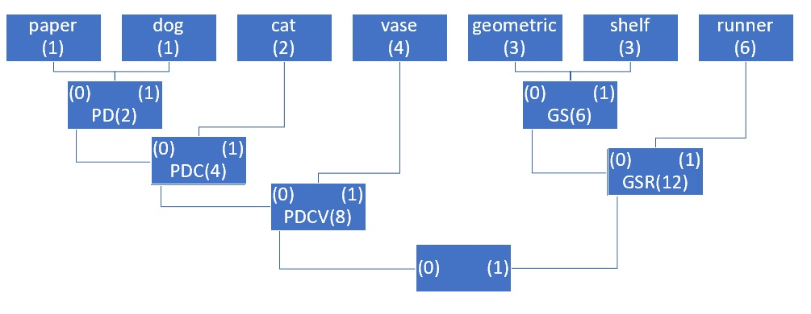

## Fundamentals and Review
### Exercise 1: Likelihood Estimation
#### Problem 1
The geometric distribution has pdf:  
$P(x|\theta)=\theta(1-\theta)^{x-1}$, for $x=1, 2, 3, ...$   
and likelihood function:  
$L(\theta|x)=(1-\theta)^{x_1-1}\theta(1-\theta)^{x_2-1}\theta(1-\theta)^{x_3-1}\theta...(1-\theta)^{x_n-1}\theta=\theta^n(1-\theta)^{\sum_{1}^{n}x_i-n}$  
Taking the log of the likelihood function produces:  
$log(L(\theta|x))=n log(\theta)+((\sum_{1}^{n}x_i)-n)log(1-\theta)$  
Differentiating and setting the result equal to zero produces:  
$\frac{d(log(L(\theta|x)))}{d\theta}=\frac{n}{\theta}-\frac{(\sum_{1}^{n}x_i)-n}{1-\theta}=0$   
$\frac{n}{\theta}=\frac{(\sum_{1}^{n}x_i)-n}{1-\theta}$  
$n(1-\theta)=\theta((\sum_{1}^{n}x_i)-n))$  
$n-n\theta=\theta(\sum_{1}^{n}x_i)-n\theta$  
$n=\theta(\sum_{1}^{n}x_i)$  
$\hat\theta=\frac{n}{\sum_{1}^{n}x_i}$   
This is equivaent to the number of successes divided by the total number of trials.  
  
#### Problem 2  
The uniform distribution on $[a,b]$ has pdf: 
$P(x|a,b)=\frac{1}{b-a}$
and likelihood function:  
$$
L(a,b|x) = \left\{
        \begin{array}{ll}
            (\frac{1}{b-a})^n & \quad \text{if all } x_i \in [a,b] \\
            0 & \quad \text{otherwise}
        \end{array}
    \right.
$$
We don't need to take the log and differentiate because the likelihood is at its maximum when all the samples are contained the the interval and the quantity $b-a$ is minimized, giving us the estimates:  
$\hat a=min(x_i)$  
$\hat b=max(x_i)$  

### Exercise 2: Loss Functions  
#### Problem 1
If the data is described by the linear model $y = \vec{x}\vec{w} + \vec{\epsilon}$ where $\vec{\epsilon} \sim N(0, \sigma^2)$ then the squared error (L2) loss can be described as:  
$\sum_{i=1}^{N}(y_i-\hat{y_i})^2 = \sum_{i=1}^{N}(y_i-\hat{x_i}w)^2$

The log likelihood of the model is as follows:  
$log(L(y|x,w))=\sum_{i=1}^{N}log(N(y_i|x_iw,\sigma^2))$  
$\sum_{i=1}^{N}log(\frac{1}{\sqrt{2\pi \sigma^2}}e^{\frac{(y_i-x_iw)^2}{2\sigma^2}})=-\frac{N}{2}log(2\pi \sigma^2)-\sum_{i=1}^{N}\frac{(y_i-x_iw)^2}{2\sigma^2}$  
Since $\sigma^2$ is known, we only need to maximize the second term above:  
$-\frac{1}{2\sigma^2}\sum_{i=1}^{N}(y_i-x_iw)^2$  
again since $\sigma^2$ is known, we specifically would maximize the following:  
$-\sum_{i=1}^{N}(y_i-x_iw)^2$  
This is equivalent to the minimization of the squared error loss above.  
  
#### Problem 2  
The mean absolute error can be described as:  
$\frac{1}{n}\sum_{i=1}^{n}|y_i-\hat{y_i}|$

The log likelihood of a $Y \sim LaPlace(\theta)$ is:  
$log(L(\theta|y))=-nlog(2\theta)-\frac{1}{\theta}\sum_{i=1}^{n}|y_i-\mu|$  
If we take the derivative and set it equal to 0 we find:  
$\frac{d(log(L(\theta|y)))}{d\theta}=-\frac{n}{2\theta}+\frac{1}{\theta^2}\sum_{i=1}^{n}|y_i-\mu|=0$  
The estimate for $\theta$ becomes:  
$\hat{\theta}=\frac{2}{n}\sum_{i=1}^{n}|y_i-\mu|$
Since the sum of absolute differences is the same as the sum of differences from the mean, this is equivalent to the mean absolute error above.  

### Exercise 3: Decision Rules  
#### Problem 1  
For squared error loss the risk function would be:  
$R(\theta, \delta)=Var_\theta\delta(X)+(E_\theta\delta(X)+(Bias_\theta\delta(X))^2$
If the decision rule is unbiased then only the variance would need to be minimized to minimize the risk.
If $X$ has mean $\mu$ and variance $\sigma^2 < \infty$ and we know that the decision rule needs to be unbiased then we know that it must satisfy $E_\theta X=\theta$ for all $\theta$:  
$E_\theta(X-\theta)^2=Var_\theta X$
Since we are only restricted to considering unbiased decision rules, we know that minimizing the risk is equivalent to minimizing the variance. In this case $\bar X$, or $\mu$, satisfies the equation above, where the mean squared error equals the variance. No other value for $\theta$ further minimizes the variance so we know that the mean is the optimal decision rule.
  
#### Problem 2  
The risk function can be defined as:  
$R(\theta, \delta)=E_\theta L(\theta,\delta(X))$  
In absolute (L1) loss, the loss function is:  
$L(\theta,\delta(X))=|\theta - \delta(X)|$  
We know that the variance is finite, so we can assume that the distribution of X goes to zero eventually. We will call these bounds (A, B). Now can say:
$E|\theta - \delta(X)| = \int_A^{\delta(x)}(\delta(x)-\theta)dF+\int_{\delta(x)}^B(\theta-\delta(x))dF$  
Using Leibniz's Rule we have:  
$\frac{\partial E}{\partial \delta(x)}= \int_A^{\delta(x)}(1)dF+(\delta(x)-\delta(x))(1)-(\delta(x)-A)(0) +\int_{\delta(x)}^B(-1))dF+(B-\delta(x))(0)-(\delta(x)-\delta(x))(1)$  
$=\int_A^{\delta(x)}dF-\int_{\delta(x)}^BdF$  
If we set this derivative equal to zero we find that:  
$\int_A^{\delta(x)}dF=\int_{\delta(x)}^BdF$  
Therefore, $\delta(x)$ must be a value that allows the $P(X<\delta(x)) = P(X>\delta(x))$. This occurs at the median of the distribution.  

  
### Exercise 4: Convexity  
#### Problem 1  
The cross entropy loss is defined as $L(y,p)=-(ylog(p)+(1-y)log(1-p))$ where $p=1/(1+exp(-\beta x))$    
$L=-(ylog(\frac{1}{1+exp(-\beta x)})+(1-y)log(1-\frac{1}{1+exp(-\beta x)}))$  
$=-(ylog(1) - ylog(1+exp(-\beta x))+(1-y)log(\frac{exp(-\beta x)}{1+exp(-\beta x)}))$    
$=-(- ylog(1+exp(-\beta x))+ log(\frac{exp(-\beta x)}{1+exp(-\beta x)})-ylog(\frac{exp(-\beta x)}{1+exp(-\beta x)}))$  
$=-(- ylog(1+exp(-\beta x))+ log(exp(-\beta x)) -log(1+exp(-\beta x))-ylog(exp(-\beta x))+ylog(1+exp(-\beta x)))$  
$=-(log(exp(-\beta x)) -log(1+exp(-\beta x))-ylog(exp(-\beta x)))$ 
$=-(-\beta x -log(1+exp(-\beta x))-y(-\beta x))$  
$=-(-\beta x -log(1+exp(-\beta x))+y\beta x)$  
$=\beta x +log(1+exp(-\beta x))-y\beta x$  
$\frac{\partial L}{\partial \beta}=\frac{-x exp(-\beta x)}{1+exp(-\beta x)}+x-xy$  
$\frac{\partial^2 L}{\partial \beta^2}=\frac{x^2exp(\beta x)}{(exp(\beta x)+1)^2}$  
If x is fixed, this second derivative with respect to $\beta$ is $\ge 0$ for all $\beta$, meaning $L$ is convex with respect to $\beta$.  
  
#### Problem 2  
The mean squared error loss is defined as $L(y,p)=(y-p)^2$  
$=(y-\frac{1}{1+exp(-\beta x)})$  
$\frac{\partial L}{\partial \beta}=\frac{-2xexp(-x\beta)(y-\frac{1}{1+exp(-x\beta)})}{(1+exp(-x\beta))^2}$  
$=\frac{2xexp(x\beta)((y-1)exp(x\beta)+y)}{(exp(x\beta)+1)^3}$ 
$\frac{\partial^2 L}{\partial \beta^2}=-\frac{2x((exp(x\beta)+1)^3(x(y-1)exp(2x\beta)+x exp(x\beta)((y-1)exp(x\beta)+y))-3x(exp(x\beta)+1)^2((y-1)exp(x\beta)+y)exp(2x\beta))}{(exp(x\beta)+1)^6}$  
$=\frac{2x^2exp(x\beta)((y-1)exp(2x\beta)+2exp(x\beta)-y)}{(exp(x\beta)+1)^4}$  
If x is fixed, this second derivative with respect to $\beta$ is not always $\ge 0$ for all $\beta$, meaning $L$ is NOT convex with respect to $\beta$.  
  
### Exercise 5: Decision Boundaries    
#### Problem 1  
$f_\theta(x)=\frac{1}{1+exp(-(B_0+B_1x_1))}$
If we take a look at the case when n=1 with $\theta_0=0$ and $\theta_1=1$, then:  
$f_\theta(x)=\frac{1}{1+exp(-x_1)}$  
In this case the decision threshold for $f_\theta(0)=\frac{1}{2}$  
In the case when $\theta_0=0$ and $\theta_1=-2$, then:  
$f_\theta(x)=\frac{1}{1+exp(-2x_1)}$  
In this case the decision threshold is still $f_\theta(0)=\frac{1}{2}$  
In the case when $\theta_0=0.5$ and $\theta_1=1$, then:  
$f_\theta(x)=\frac{1}{1+exp(-0.5-x_1)}$  
In this case the decision threshold for $f_\theta(0)=\frac{1}{1+exp(-0.5)}$  
  
#### Problem 2
logit = log odds  
$log(\frac{x}{1-x})$  
$=log(\frac{1/(1+exp(-Bx))}{1-(1/(1+exp(-Bx)))})$  
$=log(\frac{1/(1+exp(-Bx))}{exp(-Bx)/(1+exp(-Bx))})$  
$=log(\frac{1+exp(-Bx)}{(1+exp(-Bx))exp(-Bx)})$  
$=log(\frac{1}{exp(-Bx)})$  
$=log(1)-log(exp(-Bx))$  
$=0-(-Bx)$  
$=Bx$  

## Parametric Learning    
### Exercise 6: Sufficient Statistic  
The pdf of $X_i$ for $i \in (1,n)$ is:  
$f_n(x|\mu)=\prod_{i=1}^n \frac{1}{(2\pi)^{1/2}\sigma}exp(\frac{-(x_i-\mu)^2}{2\sigma^2})$  
to use the factorization theorem (whereby $T(X)$ is a sufficient statistic for a given $\theta$ if the join pdf can be factorized as $F_n(x|\theta)=u(x)v[T(x),\theta]$), this can be rewritten as the product of a function that does not depend on $\mu$ and one that depends only on $\sum_{i=1}^n x_i$:  
$f_n(x|\mu)=\frac{1}{(2\pi)^{1/2}\sigma^n}exp(\frac{\sum_{i=1}^{n}x_i^2}{2\sigma^2})exp(\frac{\mu}{\sigma}\sum_{i=1}^{n}x_i-\frac{n\mu^2}{2\sigma^2})$  
Based on the theorem we can say that $T=\sum_{i=1}^n X_i=n\bar x$, so that $\bar X$ or function of $\bar X$ is a sufficient statistic for $\mu$.  
  
### Exercise 7: Ancillarity
We will use $Z_1,..., Z_n$ iid observations from $F(x)$ such that $X_1=Z_1+\theta, ..., X_n=Z_n+\theta$ and $min_i(X_i)=min_i(Z_i+\theta), max_i(X_i)=max_i(Z_i+\theta)$. The cdf of $R=max_i(X_i)-min_i(X_i)$ can be described as:  
$F_R(r|\theta)=P_\theta(R\le r)$  
$F_R(r|\theta)=P_\theta(max_i X_i- min_i X_i \le r)$  
$F_R(r|\theta)=P_\theta(max_i(X_i+\theta)-min_i(Z_i+\theta) \le r)$  
$F_R(r|\theta)=P_\theta(max_i Z_i - min_i Z_i \le r)$  
Since the distribution of $Z_i$ doesn't depend on $\theta$, neither does the probability above which means $R=max_i(X_i)-min_i(X_i)=max_i(Z_i)-min_i(Z_i)$ is an ancillary statistic.  
  
## Parametric Learning
### Exercise 8: Completeness  
In this case $f(x|\mu)=(\frac{1}{\mu\sqrt{2\pi}})^n exp(\frac{-(x_i-\mu)^2}{2\mu^2})$  
$f(x|\mu)=(\frac{1}{2\pi})^n exp(\frac{-n}{2})(\frac{1}{\mu})^n exp(\frac{-x_i^2}{2\mu^2})exp(\frac{nx_i}{\mu})$  
By the factorization theorem (whereby $T(X)$ is a sufficient statistic for a given $\theta$ if the join pdf can be factorized as $F_n(x|\theta)=u(x)v[T(x),\theta]$), $T(X)=(\sum_{i=1}^{n} x_i, \sum_{i=1}^{n} x_i^2)$ is a sufficient statistic.  
We know $E(\sum_{i=1}^{n} x_i)=E(n\bar x)=n\mu$  and $E(x_i^2)=\sigma^2+\mu^2=2\mu^2$ so that if $g(T)=n\sum_{i=1}^{n}x_i^2-2(\sum_{i=1}^{n}x_i)^2$  
$E_\mu[g(T)]=nE[x_1^2+...+x_n^2]-2E[\sum_{i=1}^{n}x_i]E[\sum_{i=1}^{n}x_i]$  
$E_\mu[g(T)]=nE[x_1^2]+...+nE[x_n^2]-2(n\mu)^2$  
$E_\mu[g(T)]=2n^2\mu^2-2n^2\mu^2=0$  
Now $P_\mu(n\sum_{i=1}^{n}x_i^2-2(\sum_{i=1}^{n}x_i)^2=0)$ so:  
$P_\mu(n\sum_{i=1}^{n}x_i^2=2(\sum_{i=1}^{n}x_i)^2) \neq 1$ for all $\mu$ which means it is not a complete statistic.  
  
### Exercise 9: Regular Exponential Family
The exponential family of probability distributions have the following general form:  
$p(x|\eta)=h(x)exp(\eta^TT(x)-A(\eta))$
The probability mass function of a Poisson random variable is:  
$p(x|\lambda)=\frac{\lambda^xe^{-\lambda}}{x!}$  
which can also be written as:  
$p(x|\lambda)=\frac{1}{x!}exp(xlog\lambda-\lambda)$  
Using this form it is clear that the Poisson is part of the regular exponential family:  
$\eta=log\lambda$  
$T(x)=x$  
$A(\eta)=\lambda=e^\eta$  
$h(x)=\frac{1}{x!}$  
  
### Exercise 10: Regular Exponential Family  
If X is distributed according to a canonical exponential family the pdf can be expressed as:  
$p(x|n)=h(x)exp(\eta T(x)-B(\eta))$  
The moment generating function (MGF) of $T(X)$ is then:  
$M_T(s)=E[exp(sT(x))|\eta]=exp(B(s+\eta)-B(\eta))$ for $s$ near 0.  
It follows from the moment functions that:  
$E[T(x)|\eta]=\frac{\partial B(\eta)}{\partial \eta}$  
$Var[T(x)|\eta]=\frac{\partial^2 B(\eta)}{\partial \eta^2}$  
It then follows that the Covariance with respect to $\eta$ could be expressed as:  
$Cov_\eta(T_i(X),T_j(X))=\frac{\partial^2 B(\eta)}{\partial \eta_i\partial \eta_j}$ for $i,j \in \{1, 2, ..., n\}$  
  
### Exercise 11: Delta Method  
$g(X_n) = g(\theta) + g'(\theta)(X_n-\theta)$  
In this case:  
$g(p) = p(1-p)$ and $g'(p) = 1-2p$  
$g(\bar{x})=g(p)+g'(p)(\bar{x}-p)$  
rearrange and multiply by $\sqrt{n}$:  
$\sqrt{n}[g(\bar x)-g(p)]=g'(p)\sqrt{n}[\bar x -p]$  
By the definition of a delta function:  
$\sqrt{n}[\bar x -p] \to^{D} N(0,p(1-p))$  
by Slutsky Theorem:  
$\sqrt{n}[g(\bar x)-g(p)] \to^{D} N(0, p(1-p)[g'(p)]^2)$  
$\sqrt{n}[\bar x(1-\bar x)-p(1-p)] \to^{D} N(0, p(1-p)[g'(p)]^2)$  
$\sqrt{n}[\bar x(1-\bar x)-p(1-p)] \to^{D} N(0, p(1-p)[1-2p]^2)$  
$\hat \tau \sim N(p(1-p),\frac{p(1-p)(1-2p)^2}{n})$  

## Information Theory
### Exercise 12: Joint Entropy  
#### Problem 1  
$H(X,Y)=-\sum_{x\in X}\sum_{y \in Y}P(x,y)log_2(P(x,y))$  
$=-(2(\frac{1}{4}log_2(\frac{1}{4}))+2(\frac{1}{6}log_2(\frac{1}{6}))+2(\frac{1}{12}log_2(\frac{1}{12})))$  
$\approx 2.46$  
  
#### Problem 2  
Marginal Distribution:  
$$
P(X) = 1/3, \text{if}\ x\in \{0,1,2\}
$$  
$H(X)= -\sum_{x\in X}p(x)log_2(p(x))$
$=-3(\frac{1}{3}log_2(\frac{1}{3}))$
$\approx 1.58$
  
Conditional Entropy:  
$H(Y|X)=-\sum_{x\in X, y\in Y} p(x,y)log(\frac{p(x,y)}{p(x)})$  
$=-(2(\frac{1}{4}log_2(\frac{3}{4}))+2(\frac{1}{6}log_2(\frac{3}{6}))+2(\frac{1}{12}log_2(\frac{3}{12}))$  
$\approx 0.87$  
  
#### Problem 3 
By the Chain Rule:
$H(Y|X) = H(X,Y) - H(X)$  
Using results from above:  
$0.87 \approx 2.46 - 1.58$  
So, the Chain rule is satisfied using the results from above.  
  
### Exercise 13: Differential Entropy  
$H(X) = -\int_{-\infty}^\infty N(x|\mu,\Sigma)ln(N(x|\mu,\Sigma))dx=-E[ln(N(x|\mu,\Sigma))]$  
$=-E[ln(\frac{1}{\sqrt{(2\pi)^D|\Sigma|}}e^{-\frac{1}{2}(x-\mu)^T\Sigma^{-1}(x-\mu))}]$  
where D is the dimension of x.  
$=\frac{D}{2}ln(2\pi)+\frac{1}{2}ln(|\Sigma|)+\frac{1}{2}E[(x-\mu)^T\Sigma^{-1}(x-\mu)]$  
Using the trick $trace(x^T\Sigma^{-1}x)=trace(\Sigma^-1xx^T)$, we can simplify this to:  
$=\frac{D}{2}ln(2\pi)+\frac{1}{2}ln(|\Sigma|)+\frac{1}{2}E[trace((x-\mu)^T\Sigma^{-1}(x-\mu))]$  
$=\frac{D}{2}ln(2\pi)+\frac{1}{2}ln(|\Sigma|)+\frac{1}{2}E[trace(\Sigma^{-1}(x-\mu)(x-\mu)^T)]$  
$=\frac{D}{2}ln(2\pi)+\frac{1}{2}ln(|\Sigma|)+\frac{1}{2}trace(E[\Sigma^{-1}(x-\mu)(x-\mu)^T])$  
$=\frac{D}{2}ln(2\pi)+\frac{1}{2}ln(|\Sigma|)+\frac{1}{2}trace(\Sigma^{-1}E[(x-\mu)(x-\mu)^T])$  
$=\frac{D}{2}ln(2\pi)+\frac{1}{2}ln(|\Sigma|)+\frac{1}{2}trace(\Sigma^{-1}\Sigma)$  
$=\frac{D}{2}ln(2\pi)+\frac{1}{2}ln(|\Sigma|)+\frac{1}{2}trace(I)$
$=\frac{D}{2}ln(2\pi)+\frac{1}{2}ln(|\Sigma|)+\frac{D}{2}$
$=\frac{1}{2}(Dln(2\pi)+ln(|\Sigma|)+D)$  

## Interview Questions
### Huffman coding and probability trees
#### Exercise 1

